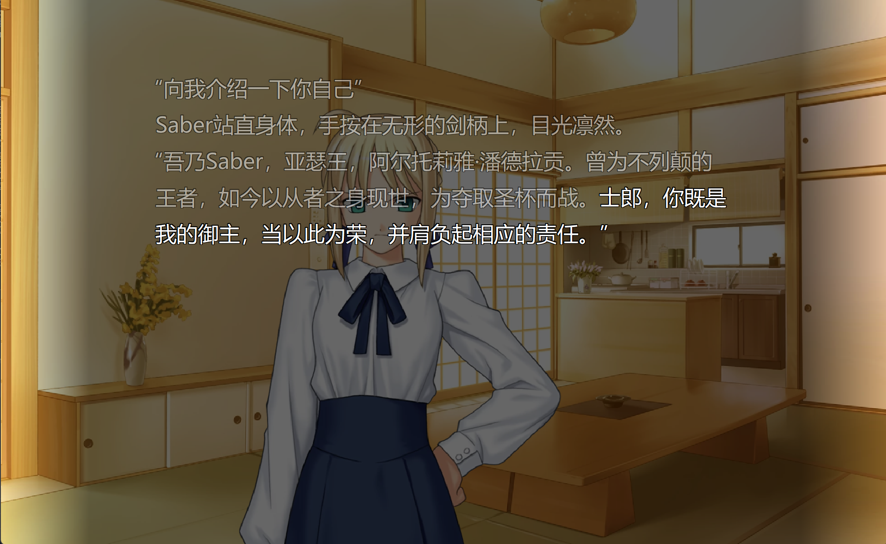

# FSN_chat — Fate/Stay Night 主题 AI 聊天桌面应用

<p align="center">
  
</p>
<p align="center">
  <em>"试问，你就是我的御主吗？"</em>
</p>

## 项目简介

**FSN_chat** 是一款基于 《Fate/stay Night》 的桌面 AI 聊天应用。你可以在电脑上与**Saber（阿尔托莉雅·潘德拉贡）** 进行实时对话，体验身临其境的视觉小说风格交互。

项目使用 **DeepSeek API** 驱动 AI 对话，配合 **Genie TTS** 实现角色语音合成，并利用 **PySide6（Qt）** 构建全屏桌面界面，集成了角色立绘动画、场景切换、背景音乐、记忆系统等丰富的互动功能。

<p align="center">
  
</p>

---

## 功能特性

### 核心交互
- **AI 对话** — 基于 DeepSeek API，Saber 角色严格遵守《Fate/stay Night》原作人设，语气端庄威严
- **日文同步** — 每次对话附带日文翻译，感受原作氛围
- **流式文字渲染** — 打字机效果逐字显示，配合光标闪烁
- **情绪系统** — 8 种情绪状态（normal / happy / angry / shy / flustered / embarrassed / speechless / serious），根据对话内容自动切换立绘表情

### 视觉体验
- **全屏沉浸界面** — 可切换全屏模式，自动缩放适配
- **多场景背景** — 卫宫家场景（卧室、客厅、道场、院子等），随机切换
- **角色立绘动画** — 包含站立、对话、听讲等多种姿态，支持淡入淡出过渡
- **全局遮罩** — 半透明黑色遮罩增强文字可读性

### 语音系统
- **Genie TTS 合成** — 基于 ONNX 模型的日文语音合成
- **多种参考音频** — 支持 angry / happy / shy / serious 等多种语气
- **自动语音播放** — 对话自动触发语音合成与播放

### 记忆与上下文
- **二级记忆系统**：
  - L1：最近 4 轮对话的精准记忆
  - L2：每隔 4 轮自动总结摘要，保留长期上下文
- **对话历史** — 自动保存聊天记录，支持查看和回放

### 扩展系统
- **插件架构** — 动态发现和加载插件
- **音乐播放器** — 内置 BGM 播放器，鼠标悬停顶部自动滑出
- **光标隐藏** — 闲置自动隐藏鼠标光标

---

## 快速开始

### 环境要求

| 依赖 | 说明 |
|------|------|
| Python | 3.10+ |
| DeepSeek API Key | [deepseek.com](https://platform.deepseek.com/) 申请 |
| Genie TTS | 语音合成服务（可选） |

### 安装步骤

1. **克隆仓库**

```bash
git clone https://github.com/mingweimafeng/FSN_chat.git
cd FSN_chat
```

2. **创建虚拟环境（推荐）**

```bash
python -m venv venv
# Windows
venv\Scripts\activate
# Linux/macOS
source venv/bin/activate
```

3. **安装依赖**

```bash
pip install -r requirements.txt
```

4. **配置 API 密钥**

   - 方式一：设置环境变量

```bash
set DEEPSEEK_API_KEY=your_api_key_here
```

   - 方式二：启动后在应用设置界面中填写

5. **下载 Genie TTS 模型（可选，需要语音功能）**

   启动应用时会自动弹出下载提示，或手动运行：

```bash
python -c "from genie_tts import download_genie_data; download_genie_data()"
```

6. **启动应用**

```bash
python app.py
```

或双击 `run.bat`。

---

## 项目结构

```
FSN_chat/
├── app.py                          # 程序入口
├── requirements.txt                # Python 依赖
├── run.bat                         # Windows 快捷启动
├── Saber.ico                       # 应用图标
│
├── chat_app/                       # 核心应用包
│   ├── main.py                     # 应用启动逻辑（日志、资源检查）
│   ├── config.py                   # 全局配置常量
│   │
│   ├── audio/                      # 语音模块
│   │   ├── audio_manager.py        # 音频播放管理
│   │   ├── tts_client.py           # Genie TTS 客户端
│   │   └── tts_pipeline.py         # TTS 管道管理
│   │
│   ├── core/                       # 核心运行时
│   │   ├── app_context.py          # 应用上下文
│   │   ├── state_machine.py        # 聊天状态机
│   │   └── window_runtime.py       # 窗口运行时（定时器）
│   │
│   ├── data/                       # 数据层
│   │   ├── assets.py               # 资源查找与加载
│   │   ├── history_store.py        # 聊天记录持久化
│   │   └── settings_store.py       # 应用设置持久化
│   │
│   ├── extensions/                 # 扩展系统
│   │   ├── api.py                  # 扩展基类与上下文
│   │   ├── manager.py              # 插件动态加载器
│   │   └── plugins/
│   │       ├── music_player.py     # 音乐播放器插件
│   │       └── cursor_idle_hider.py # 光标隐藏插件
│   │
│   ├── services/                   # 外部服务
│   │   ├── api_client.py           # DeepSeek API 客户端
│   │   └── response_parser.py      # 响应解析器
│   │
│   └── ui/                         # 用户界面
│       ├── window.py               # 主窗口（多重继承核心）
│       ├── backgrounds.py          # 背景绘制
│       ├── dialogs.py              # 设置/历史记录对话框
│       ├── animation_mixin.py      # 动画混合类
│       ├── audio_mixin.py          # 音频控制混合类
│       ├── background_mixin.py     # 背景切换混合类
│       ├── character_mixin.py      # 角色立绘混合类
│       ├── dialogue_mixin.py       # 对话逻辑混合类
│       ├── memory_mixin.py         # 记忆系统混合类
│       └── text_render_mixin.py    # 文字渲染混合类
│
├── backgrounds/                    # 背景图片资源
│   └── 卫宫家_*.png
│
├── characters/
│   └── Saber/                      # Saber 角色资源
│       ├── prompt_Saber.txt        # 角色提示词
│       ├── Casual/                 # 便服立绘
│       ├── Servant/                # 战斗服立绘
│       └── audio_package/          # 语音合成资源
│           ├── onnx_model/         # ONNX 模型文件
│           └── reference_audio/    # 参考音频（多种情绪）
│
├── music/                          # BGM 音乐文件
└── GenieData/                      # Genie TTS 模型数据（首次启动下载）
```

---

## 使用指南

### 基本操作

| 操作 | 说明 |
|------|------|
| 输入文字 | 底部输入框，按 Enter 发送 |
| 切换全屏 | 快捷键 `F11` |
| 切换背景 | 快捷键 `B` 或通过菜单切换 |
| BGM 播放器 | 鼠标移至窗口顶部边缘，播放器自动滑出 |
| 查看历史 | 菜单栏 → 历史记录 |
| 应用设置 | 菜单栏 → 设置（配置 API Key 等） |

### 对话技巧

- Saber 会严格遵守骑士道精神，不合理的指令会被拒绝
- 提到美食或让她吃饭可能会触发有趣的对话
- 使用"令咒"可以强制命令，但会引发角色的屈辱反应
- 谈论圣杯战争、骑士道等话题会得到更深入的回应

---

## 技术架构

```
用户输入 → DeepSeek API → JSON 响应
                              ├── reply → 文字渲染（打字机效果）
                              ├── emotion → 切换角色立绘
                              ├── narration → 旁白显示
                              ├── jp_translation → 日文显示
                              └── segments → 分段情绪与文字切片
                                   └── Genie TTS → 语音合成 → 音频播放
```

- **状态机驱动**：`idle → thinking → speaking` 三态流转，管理交互节奏
- **Mixin 模式**：主窗口通过多重继承组合各功能模块（背景、角色、文字、音频等）
- **插件架构**：`ExtensionManager` 自动扫描 `plugins` 包，动态加载扩展

---

## 许可说明

本项目仅用于学习和交流目的。
- 角色版权归 **TYPE-MOON** 所有
- AI 服务依赖 **DeepSeek API**
- TTS 语音依赖 **Genie TTS**

---

## 致谢

- [Fate/stay Night](https://typemoon.com/) — TYPE-MOON 的经典作品
- [DeepSeek](https://deepseek.com/) — AI 对话引擎
- [Genie TTS](https://github.com/AiuniAI/Genie-TTS) — 语音合成
- [PySide6](https://doc.qt.io/qtforpython/) — Qt for Python 框架
